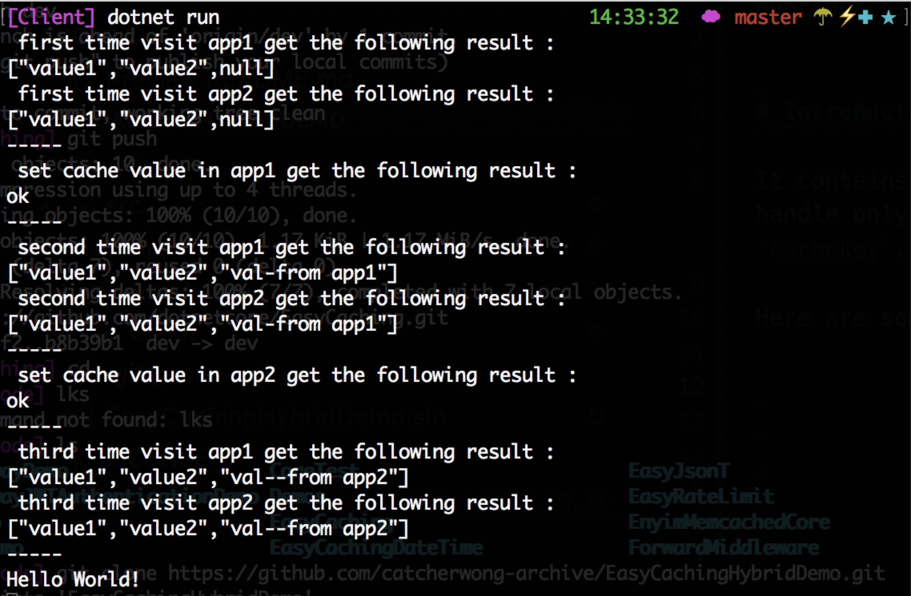
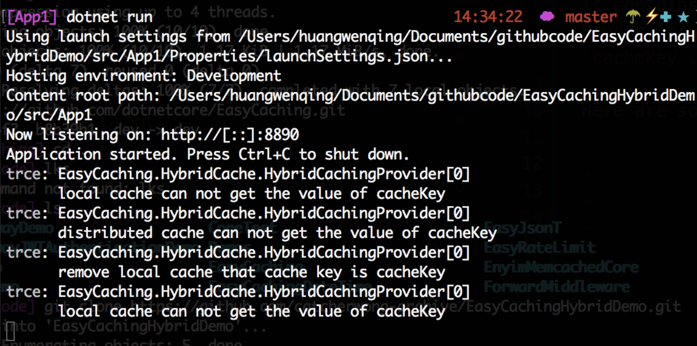
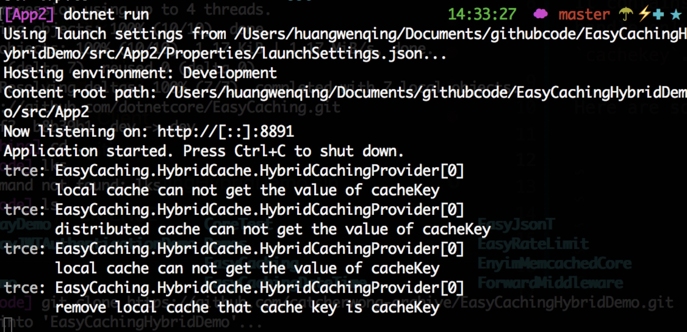

# EasyCachingHybridDemo

This repo shows how to use HybridCaching provider of EasyCaching

# Introduction

It contains two apps, both of them are handle only one cache key named `cachekey`. 

Here are some screenshots for this demo.

Running up `App1` and `App2` at first.

Then running up `Client`, you may get the following result.

1. First time, there are no cached value, both App1 and App2 get `null` value.
2. App1 sets a value(`val-from app1`) for it.
3. Second time, both App1 and App2 get `val-from app1` from cached.
4. App2 sets a value(`val-from app2`) for it.
5. Third time, both App1 and App2 get `val-from app2` from cached. Be careful, App1 does not get `val-from app1` from cached.

Let's take a look the log of App1 and App2 

